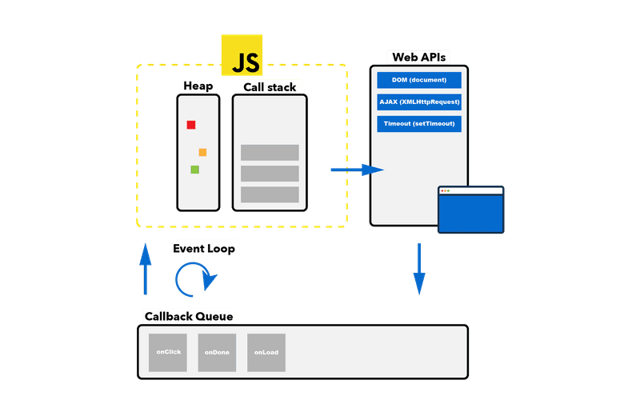

# Demo: Async JavaScript

[Edit on StackBlitz ⚡️](https://stackblitz.com/edit/demo-async-javascript)

## Event Loop Primer



JavaScript is single-threaded, because it can only do one thing at a time via one **call stack**. In the browser, funciton calls are pushed on top of the `anonymous` (file execcution) funciton. Functions are removed from the call stack through a return statement or when the end of the function scope is reached (LIFO).

**Web-APIs** are provided by the platform (browser). Web-API calls will not block the call stack.

The **Callback Queue** stores JS callback function calls received from Web-APIs (e.g. `setTimeout(() => console.log("x"), 100`). It moves these calls (e.g. `console.log("x")`) to the call stack, once the call stack is empty (FIFO).

The **Event-loop** will do the job of adding the first call in the callback queue on top of the call stack. Code that is being executed on the callstack blocks the event-loop.

*IMPORTANT*: There is another part, not mention in the diagram below: the **job-queue (or promise queue)**. This queue has priority over the callback queue, just like a fast-track queue at an amusement park. The event loop will take calls from the promise queue first, before processing the callback queue (also when written with async/await-syntax).

(Borrowed from [A. Zlatkov](https://blog.sessionstack.com/how-javascript-works-event-loop-and-the-rise-of-async-programming-5-ways-to-better-coding-with-2f077c4438b5))

## What is a Promise?

Definition: *A promise is an object that may produce a single value some time in the future*. A promise follows a well defined spec. For example it needs to implement a `then` method which returns a `resolved` and a `rejected` funciton. A promise can either be in the state *resolved*, *rejected* or *pending*. It is setteled once it is not pending. Once settled, a promise can not be resettled. Calling resolve() or reject() again will have no effect. The immutability of a settled promise is an important feature.

> **"I Promise a Result!"**
>
> "Producing code" is code that can take some time
>
> "Consuming code" is code that must wait for the result
>
> A Promise is a JavaScript object that links producing code and consuming code

```JavaScript
let myPromise = new Promise(function(myResolve, myReject) {
// "Producing Code" (May take some time)

  myResolve(); // when successful
  myReject();  // when error
});

// "Consuming Code" (Must wait for a fulfilled Promise)
myPromise.then(
  function(value) { /* code if successful */ },
  function(error) { /* code if some error */ }
);

```

(borrowed from [w3schools](https://www.w3schools.com/js/js_promise.asp))

### Benefits

- Improved errorhandling
- Way easier than to deal with callbacks

### Drawbacks

- Code still has to be written chained and nested

[Read](https://developer.mozilla.org/en-US/docs/Web/JavaScript/Reference/Global_Objects/Promise)

[Read](https://medium.com/javascript-scene/master-the-javascript-interview-what-is-a-promise-27fc71e77261)

## Async/Await

### More Benefits

- Make asynchronous code look like it is syncronous
